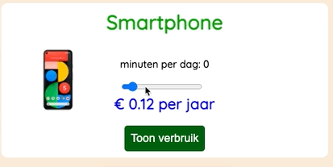

# {{ page.title }}

## Data op het dashboard tonen

Je hebt nu een (nog leeg?) Grid dat je kunt gaan vullen met inhoud.
In deze les ga je een interactieve "widget" maken waarmee je het verbruik en de kosten van verschillende apparaten kunt berekenen.

Hiervoor laad je een extern JSON bestand met gegevens van huishoudelijke apparaten en hun verbruik.
Je maakt een lijstje met apparaten waar je uit kunt kiezen. Na de keuze van het apparaat wordt de afbeelding getoond en het verbruik en de kosten dynamisch berekend.

Om dit te kunnen maken leer je in de komende video's over:

- Het XMLHttpRequest gebruiken om gegevens op te halen (herhaling).
- JSON parsen met Javascript (herhaling).
- HTML-elementen ophalen en wijzigen via het Document Object Model (DOM).
- Gebeurtenissen afhandelen uit de DOM, met Event Listeners.
- Berekeningen laten uitvoeren en het resultaat dynamisch weergeven.

De lengte van alle video's bij elkaar is ongeveer 40 minuten.
{: .fs-6 .text-blue-000}

---

[Intro en code download](1-introductie){: .btn .btn-purple .fs-6 }

