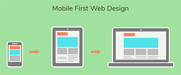

# {{ page.title }}



---

### Opdrachten
- [ ] Maak een desktop grid layout op papier zoals in de video.
- [ ] Geef alle onderdelen in je grid een korte naam.
- [ ] Maak ook mobiele versie zoals in de video. 
- [ ] Zet bij de mobiele versie alle onderdelen van de desktop versie onder elkaar en zet de juiste namen er in.

---



---

[Mobile first](2-mobile-first){: .btn .btn-purple .fs-6 }

