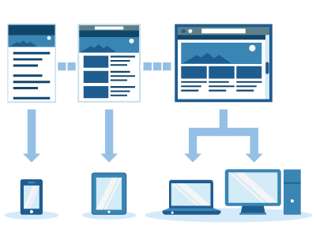

# {{ page.title }}



## CSS Grid gebruiken voor een responsive dashboard
Het is belangrijk dat je dashboard op ALLE schermgroottes er goed uitziet en dat de inhoud gebruiksvriendelijke wordt getoond.
Je dashboard moet zich daarom aanpassen aan de grootte van het scherm waarop het dashboard getoond wordt.
Als dat gebeurt, is je website **responsive**.

In de komende video's leer je over:

- Mobile First werkwijze. 
- Viewport goed zetten in je HTML.
- Grid Areas gebruiken om CSS Grid indeling makkelijker in te kunnen stellen.
- CSS Media queries gebruiken om je HTML/CSS responsive te maken.

De lengte van alle video's bij elkaar is ongeveer 60 minuten.
{: .fs-6 .text-blue-000}

---

[Responsive dashboard maken met CSS Grid](1-responsive-design){: .btn .btn-purple .fs-6 }

