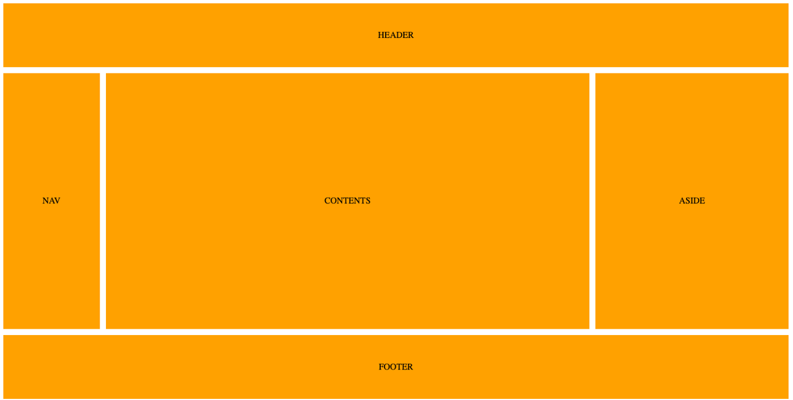
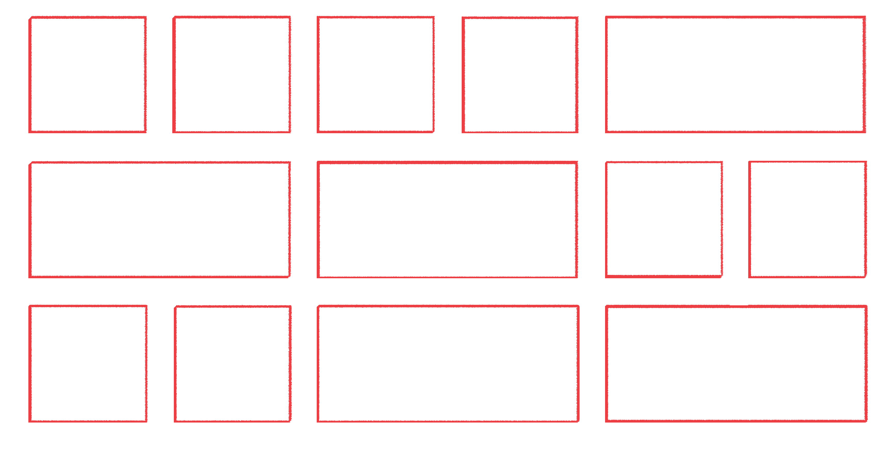
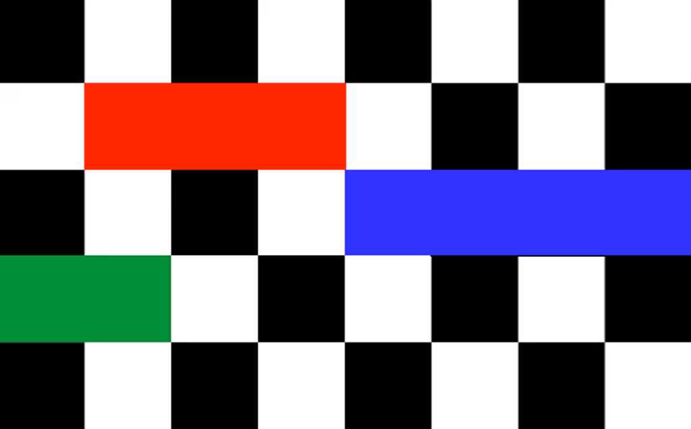

# {{ page.title }}

Kies **één** van onderstaande drie grids en maak deze na in HTML en CSS.   

Gebruik de kennis uit de video's en oefeningen die je net hebt gedaan!
{: .fs-5 .text-blue-000 }

### 1 - Oranje Grid

 

### 2 - Rood/Wit Grid

### 3 - Zwart / Wit

---




