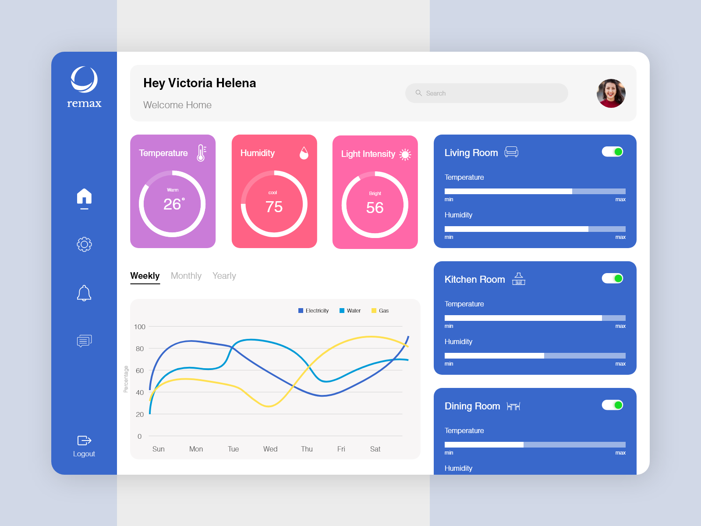

# {{ page.title }}



---

## Waarvoor gebruik je CSS Grid?
Met CSS Grid kun je een HTML-pagina layout goed opzetten door gebruik te maken van een grid systeem met rijen en kolommen.
Je hebt hierdoor goede controle over de onderdelen en inhoud van je pagina en waar deze in je pagina layout geplaatst worden.

Je kunt een grid ook goed *responsive* maken, zodat het grid er op zowel kleine als grotere schermen er goed uit ziet.

Gebruik deze informatie en video's om het ontwerp van je Duurzaam Huis dashboard te vertalen naar HTML en CSS met de kennis over CSS Grid!
{: .fs-6 .text-green-200 }

De lengte van alle video's bij elkaar is ongeveer 35 minuten.
{: .fs-6 .text-blue-000}

---
[Aan de slag met CSS Grid](1-grid-container){: .btn .btn-purple                                                                                                                                                                                                                                                                                                                                                                                                          .fs-6 }

---

*Voorbeeld van een dashboard dat je goed met de CSS Grid techniek kan maken in HTML en CSS.*

