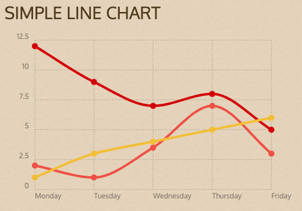

# {{ page.title }}

## Gegevens in een chart weergeven

In de laatste twee weken ga je aan de slag met het weergeven van gegevens in een grafiek of chart.

- Eerst verzamel je de gegevens die je wilt tonen en bepaalt de labels en de datapunten
- Je kiest vervolgens welk type grafiek goed is om de gegevens te tonen.
- Met een bestaande Chart code library ga je aan de slag om de gegevens te tonen.
- Hiervoor moet je de gegevens in arrays in Javascript zetten,
- Je krijgt een beetje start-code, de rest moet je zelf werkend maken.
- Aan het einde van deze les gebruikt jouw script gegevens uit een extern JSON-bestand om de chart te maken.
- Volgende les ga je ervoor zorgen dat de gegevens uitje MySQL database worden gelezen met PHP.

De lengte van alle video's bij elkaar is ongeveer 15 minuten.
{: .fs-6 .text-blue-000}

---

[Intro en code download](1-introductie){: .btn .btn-purple .fs-6 }

